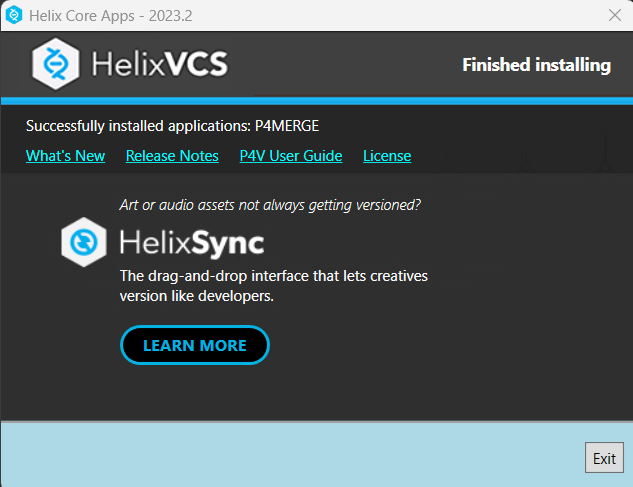

# TRABAJO PRACTICO 1

## 1) Instalar Git

## 2) Crear un repositorio local y agregar archivos

## 4) Creación de Repos 01 -> Crearlo en GitHub, clonarlo localmente y subir cambios

## 5) Creación de Repos 02-> Crearlo localmente y subirlo a GitHub

## 6) Ramas

## 7) Merges

## 8) Resolución de conflictos

## 9) Familiarizarse con el concepto de Pull Request

Una solicitud de extracción es un mecanismo que facilita la colaboración y la revisión de código en proyectos de desarrollo de software. Permite a los colaboradores proponer cambios de manera estructurada, recibir retroalimentación de otros miembros del equipo y asegurarse de que los cambios se integren de manera ordenada en la rama principal del repositorio.

